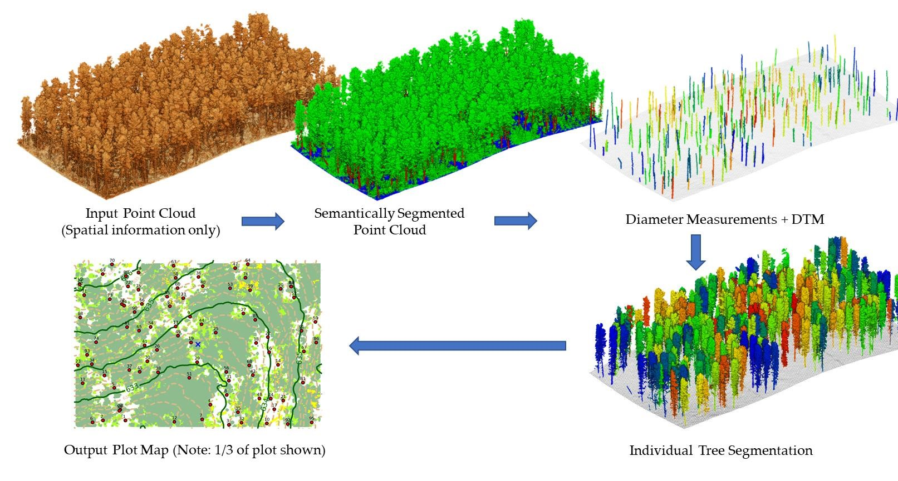

# Hello there! 👋

I'm a student at ZHAW (Zurich University of Applied Sciences) with a strong focus on **Spatial Data Science, GIS, and Environmental Modeling**. I am passionate about working at the intersection of natural sciences and data analysis.

Here are some of my key projects from my studies at ZHAW:

<table>
  <tr>
    <td width="30%">
      
    </td>
    <td width="70%">
      <h3><a href="https://github.com/LukasBuchmann/PA2-Modelling_Wildlife_Corridors">Modelling Wildlife Corridors: Spatial Analysis of Landscape Barriers</a></h3>
      
The project implements a reproducibility-focused workflow using Python and open-source geospatial libraries. It utilizes OpenStreetMap (OSM) combined with Corine Land Cover (CLC) to calculate resistance surfaces and perform Least-Cost Path (LCP) analysis to identify potential wildlife corridors and critical bottlenecks.

      <a href="https://lukasbuchmann.github.io/PA2-Modelling_Wildlife_Corridors/">👉 Check out the project website (Quarto)</a>
    </td>
  </tr>
  <tr>
    <td width="30%">
      
    </td>
    <td width="70%">
      <h3><a href="https://github.com/LukasBuchmann/PA1---Point-Cloud">Deep Learning for tree segmentation in Forest using UAV based LIDAR Data</a></h3>
      
This project investigates the use of deep learning models for the semantic segmentation of individual tree parts from UAV-based LiDAR point clouds, using the high-quality FOR-Instance dataset and synthetic data.
The project addresses key research questions in forest monitoring by evaluating the capability of modern deep learning approaches to generalize to various forest types and data sources.

    </td>
  </tr>
  <tr>
    <td width="30%">
      
    </td>
    <td width="70%">
      <h3><a href="https://github.com/LukasBuchmann/Site_Suitability_Analysis">Site Suitability Analysis for Wind Energy: A Raster-based Multi-Criteria Approach</a></h3>
      
This project identifies suitable locations for wind turbine development in Canton Thurgau using a Geographic Information System (GIS)-based Multi-Criteria Analysis (MCA). It systematically overlays spatial criteria, such as wind speed, distance to settlements, and protected areas, to calculate a suitability index that balances economic, technical, and legal requirements.

      <a href="https://github.com/LukasBuchmann/Site_Suitability_Analysis/blob/main/docs/Buchmann_Lukas_Project_Report_GISScience_GDB.pdf">👉 Read the full Project Report (PDF)</a>
    </td>
  </tr>
</table>

> **ℹ️ Note on Repositories:** The projects showcased above were originally developed, version-controlled, and hosted on the internal ZHAW Enterprise GitHub during my studies. They have been migrated to this personal account to serve as a public portfolio.
<!--
**LukasBuchmann/LukasBuchmann** is a ✨ _special_ ✨ repository because its `README.md` (this file) appears on your GitHub profile.

Here are some ideas to get you started:

- 🔭 I’m currently working on ...
- 🌱 I’m currently learning ...
- 👯 I’m looking to collaborate on ...
- 🤔 I’m looking for help with ...
- 💬 Ask me about ...
- 📫 How to reach me: ...
- 😄 Pronouns: ...
- ⚡ Fun fact: ...
-->
